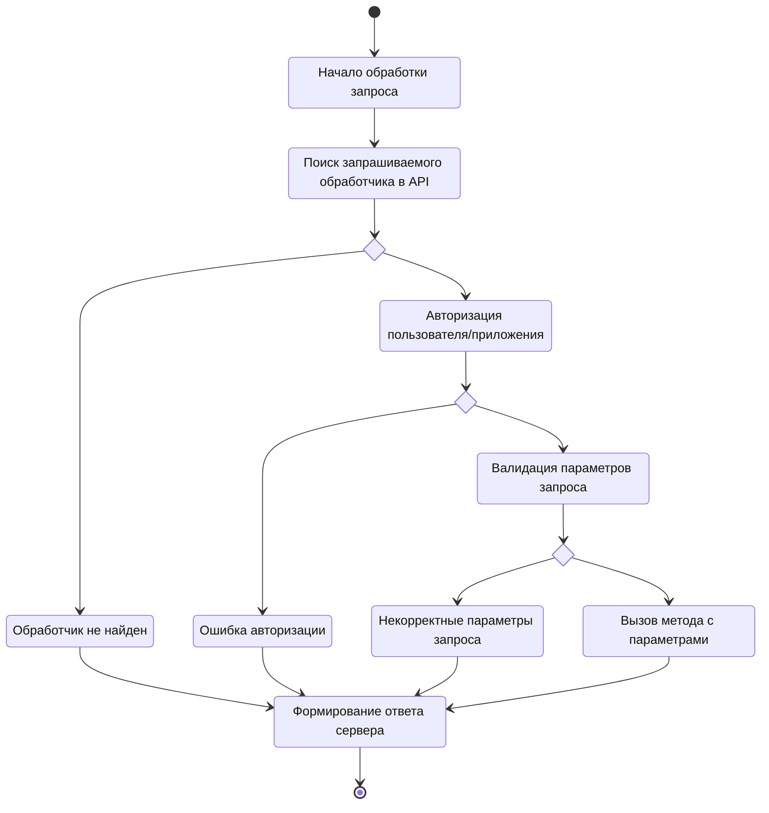

# API

В процессе написания
{: .label .label-yellow }

[Реализация API](https://github.com/HCM-guru/webtutor-api) для WebSoft HCM.

## Зачем?

Данное API реализовано для сокращения времени разработки серверной части API на WebSoft HCM.

API уже включает в себя реализации для авторизации и валидации параметров запроса, что позволяют ускорить разработку новых компонентов.


### Структура

Благодаря четкой структуре файловой системы вам будет удобно реализовывать компоненты вашей системы.

```
src
└─── controllers
│   │   collaborators.ts
│   │   events.ts
|   |   my_custom_controller.js
|   | ...
└─── services
│   │   events.ts
│   │   file.ts
|   |   my_custom_service.js
|   | ...
└─── utils
    │   array.ts
    │   assert.ts
    |   my_custom_util.js
    | ...
```

## Как работает API?

API подразумевает под собой полный цикл REST API с авторизацей, валидацией параметров, формированием ответа сервера клиенту.

### Диаграмма состояния

